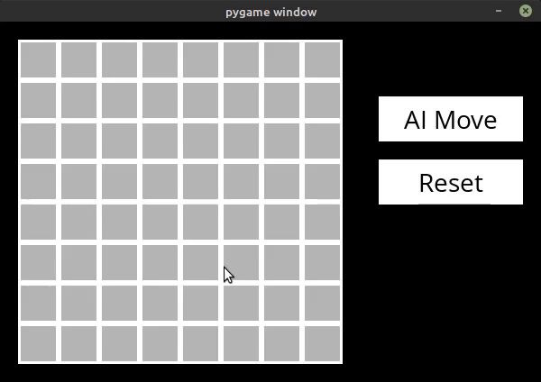

<h1 align="center">
  AI-minesweeper
</h1>

<p align="center">
 <a href="#objetivo">Objetivo</a> •
 <a href="#requisitos">Requisitos</a> • 
 <a href="#passo-a-passo">Passo-a-passo</a> • 
 <a href="#autor">Autor</a>
</p>

### Objetivo

<p>
Este projeto tem como objetivo aplicar o agente inteligente do tipo baseado no conhecimento para jogar o jogo campo minado.

Este agente inteligente é definido na inteligência artificial de forma a tomar as suas decisões baseadas em conhecimento *a priori* do mundo e conhecimento *a posteriori* (por meio das inferências possíveis).

O campo minado é um jogo que tem como característica tomar decisões baseadas no conhecimento de quantas minas temos ao redor de uma localização. Por isso, o agente baseado no conhecimento foi propício para resolver este tipo de jogo.

Parte deste projeto foi disponibilizado por [Harvard Extension School](https://extension.harvard.edu/) como um projeto a ser melhorado pelos alunos que acompanharam uma das palestras do [CS50’s Introduction to Artificial Intelligence with Python](https://cs50.harvard.edu/extension/ai/2020/spring/). Neste [link](https://cs50.harvard.edu/extension/ai/2020/spring/projects/1/minesweeper/) é especificado o que ainda precisava ser desenvolvido no projeto para tornar o programa totalmente funcional.
</p>

<p align="center">
  <h1 style="display: flex;">
    
  </h1>
</p>

### Requisitos

Para rodar este jogo, você vai precisar ter instalado em sua máquina as seguintes ferramentas:
[Git](https://git-scm.com) e [Python + pip](https://www.python.org/downloads/).

### Passo-a-passo

```bash
# Clone este repositório
$ git clone https://github.com/Daniel-Alencar/AI-minesweeper

# Acesse a pasta do projeto no terminal/cmd
$ cd AI-minesweeper

# Instale as dependências
$ pip3 install -r requirements.txt

# Execute a aplicação
$ python3 runner.py
```

### Autor


Implementação especificada concluída por Daniel Alencar!

[](https://www.instagram.com/daniel_alencar_/) [](https://www.linkedin.com/in/Daniel746/) [](mailto:danielalencar746@gmail.com)